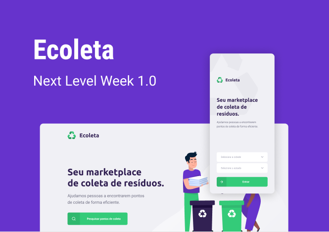

<div align="center">
  <h1>
    :recycle: <i>Ecoleta</i>
  </h1>

  <p>
    Projeto feito com ReactJS & JavaScript na semana do Next Level Week (NLW)
  </p>

  
</div>

## :open_book: Sobre

Ecoleta é um projeto baseado na NLW. Ele conecta pessoas que querem ou não sabem a maneira certa de descartar o lixo com companias de reciclagem, descarte de óleo e etc. Esse lixo pode ser pilhas, residuos orgânicos, óleo e muito mais.

## :artificial_satellite: Tecnologias usadas

* Node.js
* JavaScript/TypeScript
* ReactJS
* React Native
* Expo


## :dart: Como usar

Para usar rodar as aplicações é nescessario ter instalado na sua maquina o Node.js e o Git. Depois basta seguir os passos a seguir.

Antes de tudo, é nescessario você instalar as dependencias. Para isso basta rodar os seguintes comandos em seu terminal/prompt.

```shell
# Vai clonar a pasta do projeto para a sua maquina
git clone https://jefferson-calmon.github.io 

# Vai abrir a pasta do projeto
cd ecoleta 
```

Depois disto 

### Back-end

Primeiro vamo iniciar o server